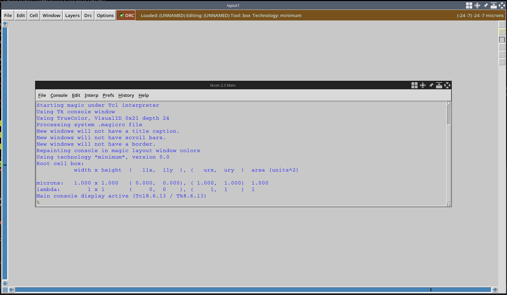
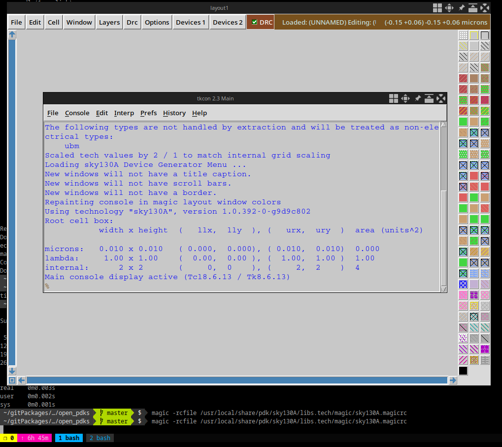
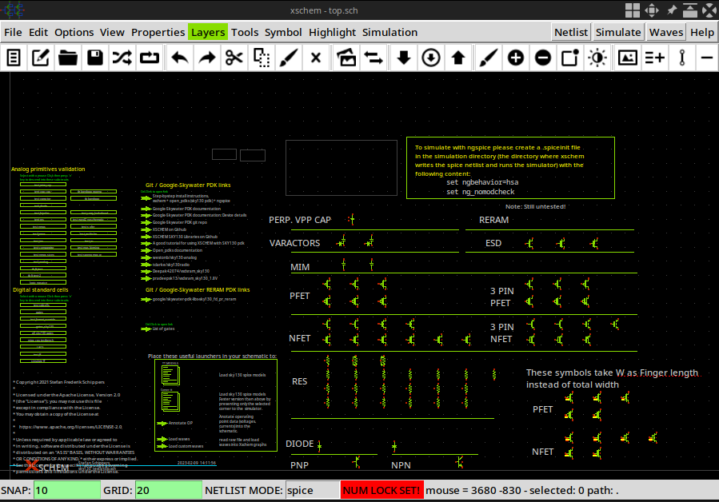
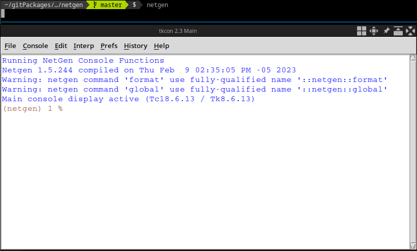

# Instalación de Herramientas

## Entorno donde fue realizada la instalación

Estos comandos fueron realizados en:

```bash
$ uname -r
Linux catalejo 6.1.0-2-amd64 #1 SMP PREEMPT_DYNAMIC Debian 6.1.7-1 (2023-01-18) x86_64 GNU/Linux
```

```bash
$ lsb_release -a
No LSB modules are available.
Distributor ID: Debian
Description:    Debian GNU/Linux bookworm/sid
Release:        n/a
Codename:       bookworm
```

## Lugar usado para las instalaciones (lo pongo como ejemplo)

```bash
mkdir -p ~/gitPackages/vlsi
cd ~/gitPackages/vlsi
```

```bash
~/gitPackages/vlsi  $  pwd
/home/johnny/gitPackages/vlsi
```

En ese lugar he descargado los paquetes necesarios según instrucciones más adelante quedando al final de todas las instalaciones así:

```bash
 ~/gitPackages/vlsi  $  ls
cad/  magic/  netgen/  ngspice-39/  ngspice-39.tar.gz  open_pdks/  skywater-pdk/  xschem-3.0.0/  xschem-3.0.0.tar.gz
```

## Instalación de skywater

```
git clone git@github.com:google/skywater-pdk.git
cd skywater-pdk/
git submodule init libraries/*/latest
git submodule update
make -j$(nproc)
make timing -j$(nproc)
```

## Instalación de Magic



```bash
sudo apt install m4 tcsh csh libxpm-dev libx11-dev tk-dev libcairo2-dev mesa-common-dev libglu1-mesa-dev libncurses-dev gcc
```

```bash
git clone https://github.com/RTimothyEdwards/magic.git
cd magic/
./configure
make
sudo make install
```

### Instalación de open-pdks

```bash
git clone git@github.com:RTimothyEdwards/open_pdks.git
cd open_pdks
./configure --enable-sky130-pdk=/home/johnny/gitPackages/vlsi/skywater-pdk/libraries \
--with-sky130-local-path=/home/johnny/gitPackages/vlsi/cad/
make -j$(nproc)
sudo make install
```

### Crear layout para skywater 130




```bash
magic -rcfile /usr/local/share/pdk/sky130A/libs.tech/magic/sky130A.magicrc
```

Puede ser agregando en `.bashrc` como un alias, ejemplo:

```bash
alias magic_design="magic -rcfile /usr/local/share/pdk/sky130A/libs.tech/magic/sky130A.magicrc"
```

## NGSPICE

```bash
sudo apt-get install libxaw7-dev libreadline-dev -y
```

```bash
wget -O "ngspice-39.tar.gz" https://sourceforge.net/projects/ngspice/files/ng-spice-rework/39/ngspice-39.tar.gz/download
tar xvf ngspice-39.tar.gz
cd ngspice-39
./configure --with-x --enable-xspice --enable-cider --with-readline=yes --enable-openmp --disable-debug CFLAGS="-m64 -O2" LDFLAGS="-m64 -s"
make -j$(nproc)
sudo make install
cd example/soi/
ngspice inv_dc.sp
```

## XSCHEM



```bash
sudo apt install libx11-xcb-dev flex bison
```

```bash
wget http://repo.hu/projects/xschem/releases/xschem-3.0.0.tar.gz
tar xvf xschem-3.0.0.tar.gz
cd xschem-3.0.0/
./configure
make
sudo make install
cp /usr/local/share/pdk/sky130A/libs.tech/xschem/xschemrc ~/.xschem/
```

## Instalar NETGEN




```bash
git clone https://github.com/RTimothyEdwards/netgen
cd netgen/
./configure
make
sudo make install
```

Prueba realizada Mar 10, 2023
Johnny Cubides
